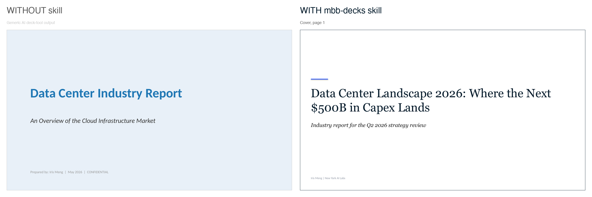
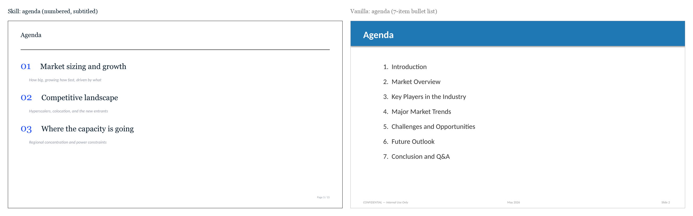
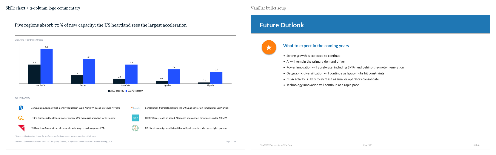
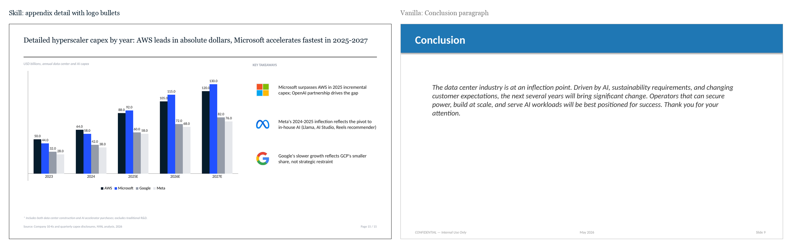
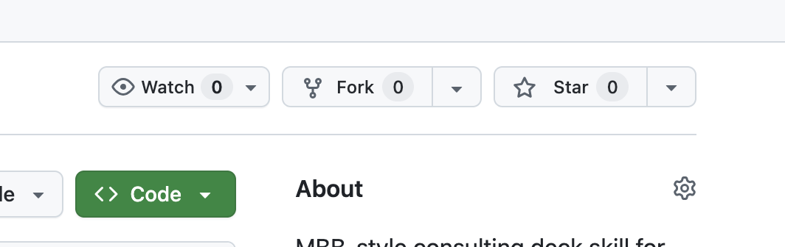

# MBB Decks

[](https://github.com/floflo11/mbb-decks/stargazers)
[](LICENSE)

> Real consulting decks from Claude. Not slop.

Codified from three years drafting decks alongside ex-MBB executives. [About the author](#about-the-author).

## Without skill vs with skill

Same prompt, same topic (a data center industry report), same author. **Left** is what Claude produces by default. **Right** is what Claude produces with this skill installed.









Both decks are committed to the repo. Open them in PowerPoint or Keynote and flip through.

## Install

If you do not have Claude Code, get it first:

```bash
curl -fsSL https://claude.com/install.sh | sh
```

Then open Claude Code (run `claude` in your terminal) and paste both lines:

```
/plugin marketplace add floflo11/mbb-decks
/plugin install mbb-decks
```

Now prompt:

> Build me an MBB-style deck on [your topic]. Use the mbb-decks skill.

The first time the skill runs it self-checks for Python and `python-pptx` and tells you the one command to run if anything is missing.

> This skill is built for CLI agents (Claude Code, Codex CLI, Gemini CLI, Cursor). The `SKILL.md` format is an open standard at [agentskills.io](https://agentskills.io/specification), so the same skill works across them. A hosted web version for users who are not on a CLI agent is on the roadmap.

## Star to follow

<p align="center">
  <a href="https://github.com/floflo11/mbb-decks">
    
  </a>
</p>

<p align="center"><strong>↑ Click the Star button at the top of this page</strong></p>

If the comparison above made you smile, **star this repo to follow more Microsoft Office skill releases**. Coming next:

- **Excel**: three-statement models, LBO, sensitivity tables, valuation builds
- **Word**: IC memos, board prereads, one-pagers
- **Outlook**: partner-style email and follow-ups

[**Vote on which ships first.**](https://github.com/floflo11/mbb-decks/discussions/1) Stars on this repo measure overall momentum; the poll captures topic preference. Both signals stay on one repo.

## What's different

> The first thing I learned in consulting: a deck is not bullet points, it is a storyline.

This skill teaches Claude four house-style conventions:

- **Action titles tell the story.** Read the headlines top to bottom; that is the deck.
- **One claim, one chart, one slide.** With the takeaways panel beside it. Never split a chart from its commentary.
- **Logos for companies, not letters in circles.** Real brand marks, auto-fetched, where they belong.
- **Fifteen slides, hard cap.** Partners do not read further. Detail goes in the appendix.

The exact rules and the JSON schema live in [`SKILL.md`](SKILL.md).

## Examples

- [`examples/data-center-landscape/`](examples/data-center-landscape/): the deck behind the comparison images above. Industry report with logos on every bullet that names a company.
- [`examples/market-entry/`](examples/market-entry/): Vietnam JV recommendation. Owner / Action / Outcome table at the close.

## About the author

Built by [Iris Meng](https://www.linkedin.com/in/yilin-meng/), founder of [New York AI Labs](https://newyorkailabs.com), where she works on applied AI for finance teams. Three years at EY NYC advising $40B+ M&A deals.

## License

MIT. See [LICENSE](LICENSE).
