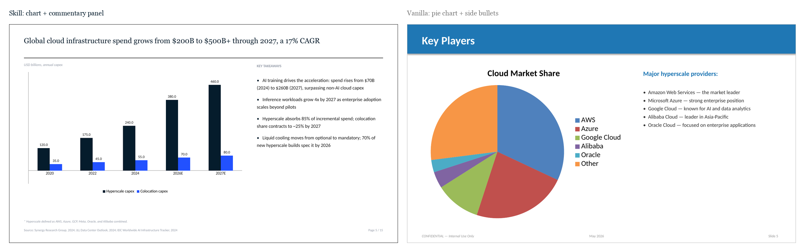

# Example: Data Center Landscape 2026

Side-by-side comparison of an industry report rendered with the `mbb-decks` skill versus a deliberately generic AI-deck-tool baseline. Same topic, same author bio, same approximate length. Open both files and flip through.

| | Skill version | Vanilla version |
|---|---|---|
| **File** | [`skill-version.pptx`](skill-version.pptx) | [`vanilla.pptx`](vanilla.pptx) |
| **Slides** | 15 (12 main + 3 appendix) | 10 |
| **Title style** | Action-title sentence per slide | Label per slide ("Market Overview") |
| **Storyline** | Reads as one argument across all action titles | None; section labels with bullet soup underneath |
| **Charts** | Data labels on every bar at 1 decimal; suppressed y-axis; chart and commentary on the same slide | 3D-style pie chart, axis-only, no labels; bullet slide separate from chart slide |
| **Bullets per slide** | 3 to 5, MECE, parallel structure | 6 to 8, overlapping, generic |
| **Bullet markers** | Real company logos when the bullet names a single entity (auto-fetched from Hunter.io); plain navy glyphs for concept bullets | Decorative circles with letters next to slide titles |
| **Recommendations** | Action table with Owner / Action / Outcome and dates | "Conclusion" paragraph + "Thank You" slide |
| **Visual system** | Georgia headlines, Calibri body, navy + black + white | Default Calibri throughout, generic blue + teal + orange |
| **Footer** | `Page X / Y`, no date, no watermark | Date + "CONFIDENTIAL" + Slide N |
| **Closing** | Recommendation slide with explicit owners and dates | "Thank You! Questions & Discussion" |

## Visual comparisons

### Cover (page 1)


The skill cover makes a claim ("Where the Next $500B in Capex Lands"). The vanilla cover is a label ("Data Center Industry Report"). Same author, same topic; the first invites the reader, the second files itself away.

### Chart slide (skill page 5 vs vanilla page 5)



The skill version pairs the chart with a "KEY TAKEAWAYS" panel on the same slide, so the reader gets the picture and the takeaway in one view. Bars carry data labels at 1 decimal; gridlines and the y-axis numeric labels are suppressed because the bar labels carry the precision. The vanilla version uses a 3D-style pie chart for share, which every MBB style guide explicitly disrecommends, and pads it with generic side bullets ("the market leader", "strong enterprise position").

### Analytical content (skill page 11 vs vanilla page 8)


The skill version puts the chart full-width on top and the commentary in a 2-column row below. Each commentary bullet is anchored to a real entity, with the entity's logo serving as the bullet marker: Dominion Energy, Hydro-Quebec, MidAmerican, Constellation, ERCOT, and Saudi PIF. The vanilla version is the canonical AI-deck "Future Outlook" slide: a decorative orange circle with a star, a generic header, and six parallel bullets that say nothing specific.

### Closing detail (skill page 15 vs vanilla page 9)


The skill version's appendix carries detail the partner can verify in 30 seconds: hyperscaler capex by year with the three relevant company logos in the takeaways panel and a clear footnote on what is included. The vanilla version's "Conclusion" is a paragraph of italicized prose ending in "Thank you for your attention", readable but unverifiable, with no numbers, no specifics, and no anchor on what to actually do.

## What the comparison demonstrates

1. **Action titles vs labels.** Read the action titles in the skill version top to bottom: they form one coherent argument from market sizing to recommendation. Read the slide titles in the vanilla version: "Introduction, Market Overview, Key Players, Trends, Challenges, Conclusion." The first tells a story. The second is a table of contents.
2. **Charts that prove a claim vs charts that decorate.** The skill version's first chart is paired with the action title *"Global cloud infrastructure spend grows from $200B to $500B+ through 2027, a 17% CAGR"*. The chart proves the claim with labeled bars and a takeaways panel beside it. The vanilla version uses a 3D-style pie chart for share-of-market.
3. **Logos as bullet markers vs decorative icons.** The skill version uses a company's actual logo (auto-fetched from Hunter.io) wherever a bullet focuses on a single entity. The vanilla version uses orange/teal circles with letters inside, which is exactly the AI-deck-tool aesthetic the skill is designed to avoid.
4. **One artifact per slide vs split content.** The skill version merges chart and commentary onto the same slide. The vanilla version puts a chart on one slide and the bullets explaining it on the next, which is the most common AI-deck failure mode.
5. **Recommendation with owners vs "Thank You" closer.** The skill version ends on a four-row action table: Investment team, Strategy team, Partnerships, Capital markets, each with a concrete action and outcome. The vanilla version ends on a "Thank You" slide. One is a partner pre-read; the other is a college presentation.

## Render them yourself

```bash
# Skill version
python ../../scripts/build_deck.py input.json skill-version.pptx

# Vanilla version
python build_vanilla.py vanilla.pptx
```

## Storyline (skill version)

Read these action titles top to bottom. They are the entire argument of the deck.

1. Hyperscalers will spend $500B+ through 2027, concentrating capacity in five power-rich regions
2. Global cloud infrastructure spend grows from $200B to $500B+ through 2027, a 17% CAGR
3. Top 4 hyperscalers control 78% of cloud spend; AWS leads but Azure and GCP gain share each year
4. Colocation remains fragmented: top 5 hold just 35% combined, with Equinix and Digital Realty leading
5. Hyperscalers move toward self-build for AI; colocation pivots to enterprise hybrid and AI startups
6. Five regions absorb 70% of new capacity; the US heartland sees the largest acceleration
7. Build NYAL data center exposure in Texas and Quebec; partner with colocation incumbents in tier-2 metros

The body content (bullets, charts, footnotes, sources, logos) only exists to prove these claims.

## A note on the data

Numbers in this example are illustrative for demonstration. Hyperscaler share, capex projections, and regional capacity figures are drawn from publicly cited industry sources (Synergy Research, JLL, IDC, Dell'Oro, Structure Research) but rounded and stylized for a clean example. Do not redistribute as research output.
